# Incident Response Report   Spear-Phishing Campaign (PhishStrike)

**Classification:** TLP:AMBER   Internal Use
**Incident Category:** Spear-Phishing / Malware Delivery
**MITRE ATT&CK Tactics:** Initial Access (T1566.002), Execution (T1059.001, T1204.002), Persistence (T1547.001), Command and Control (T1102, T1071.001)
**Analyst:** Threat Intel / Email Forensics
**Status:** Closed   IOCs extracted, no evidence of successful faculty compromise confirmed in scope of this lab

---

## 1. Executive Summary

An educational institution faculty member received a spear-phishing email spoofing a trusted internal contact, alleging a completed **$625,000 (COP)** purchase and prompting the recipient to retrieve an "invoice" via an embedded link. Header analysis confirmed authentication failures consistent with domain spoofing. The linked infrastructure served multiple malware families   a cryptomining payload, **BitRAT**, and **AsyncRAT**   from a shared distribution path. Dynamic analysis confirmed registry-based persistence, sandbox-evasion delay tactics, and dual C2 channels (a dynamic DNS domain and abuse of the legitimate Telegram Bot API).

## 2. Timeline of Events

All timestamps are UTC unless otherwise noted.

| Timestamp (UTC) | Event | Source |
|---|---|---|
| 2022-10-22 06:35:08 | `hxxp[://]107.175.247[.]199/loader/server.exe` (BitRAT payload) first indexed | URLhaus |
| 2022-10-22 06:36:06 | `hxxp[://]107.175.247[.]199/loader/Rckjlz.exe` (PureCrypter, out of scope   see §5.3 note) first indexed | URLhaus |
| 2022-10-22 12:39:04 | CoinMiner payload (`453fb1c...562f0`) indexed at `hxxp[://]107.175.247[.]199/loader/install.exe`; abuse complaint sent to host 12:40:12 same day | URLhaus |
| 2022-10-25 (time n/a) | AsyncRAT payload (`5ca468704e...58f791`) indexed from same host/path | URLhaus |
| 2022-10-26 10:11 | BitRAT payload (`bf7628695c...639539`) submitted to MalwareBazaar | MalwareBazaar |
| 2022-10-26 10:18:23 | Automated sandbox verdict: Malicious (100/100)   BitRAT dropper behavior confirmed | ANY.RUN |
| 2022-12-09 08:58:26 | Phishing email delivered, impersonating `uptc.edu.co`, originating IP `18.208.22[.]104` | Email Message-ID timestamp |
| 2022-12-12 07:00:08 | Distribution host `107.175.247[.]199` taken offline | URLhaus |

**Note on the ~7-week gap:** The malware samples and hosting infrastructure at `107.175.247[.]199` were first documented in **late October 2022**, roughly seven weeks before this specific phishing email was sent (**December 9, 2022**). This is consistent with the actor reusing already-established distribution infrastructure for a new delivery wave rather than standing up new infrastructure per campaign. This is an inference based on infrastructure-reuse timing, not confirmed by the available lab dataset   there is no direct evidence tying this specific email to the October sample submissions beyond the shared host and URL path.

## 3. Email Header & Authentication Analysis

**Subject:** "Commercial Purchase Receipt Online 27 Nov"
**Display Name:** Erika Johana Lopez Valiente
**From / Return-Path:** `erikajohana.lopez@uptc.edu[.]co`
**Message-ID:** `<CABWu4iua5_uex6=G8pi_OJz1tBLJiNakMK-1=7128orpzxbKxw@mail.gmail[.]com>`
**Originating IP:** `18.208.22[.]104`
**rDNS of Originating IP:** `inpost.tmes.trendmicro[.]com`

| Check | Result |
|---|---|
| SPF | Softfail (originating IP not authorized for `uptc.edu.co`) |
| DKIM | Fail/Neutral   signature present but verification did not pass |
| DMARC | Fail   `p=reject; sp=reject` policy defined but message still delivered to inbox for analysis |

**Assessment:** The mismatch between the claimed sending domain (`uptc.edu.co`) and both the originating IP's rDNS (a Trend Micro/InPost-associated host) and the SPF record for `uptc.edu.co` confirms the message did not originate from the legitimate institution's mail infrastructure. This is a textbook display-name/domain spoof rather than a compromised legitimate account.

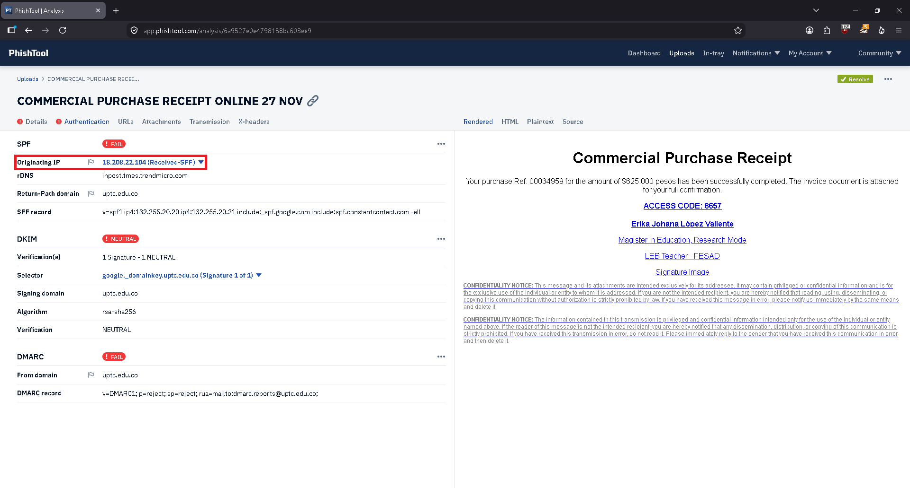
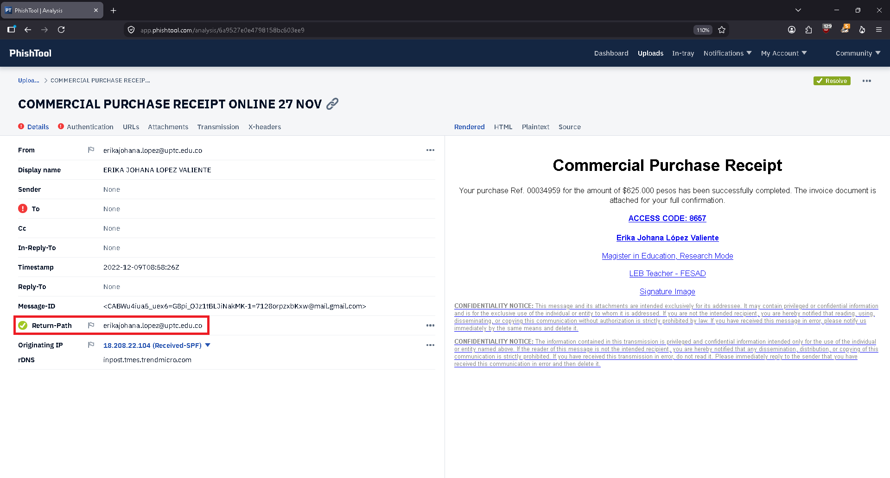

## 4. Malicious Link Analysis

The email body embeds a link disguised as an invoice/document download. Extraction via PhishTool identified:

- **URL:** `hxxp[://]107.175.247[.]199/loader/install.exe`
- **Host IP:** `107.175.247[.]199`

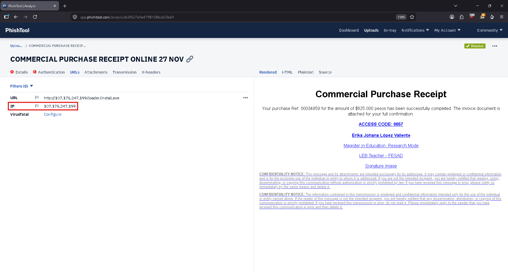

### 4.1 URLhaus Correlation

The host `107.175.247[.]199` is documented on URLhaus with multiple payloads served from the same `/loader/` directory over a narrow window (Oct 22–26, 2022), indicating a shared malware distribution server rather than a single-purpose dropper:

| Date Added (UTC) | URL | Tags |
|---|---|---|
| 2022-10-22 | `hxxp[://]107.175.247[.]199/loader/install.exe` | AsyncRAT, bitrat, CoinMiner |
| 2022-10-22 | `hxxp[://]107.175.247[.]199/loader/Rckjlz.exe` | PureCrypter |
| 2022-10-22 | `hxxp[://]107.175.247[.]199/loader/server.exe` | bitrat |

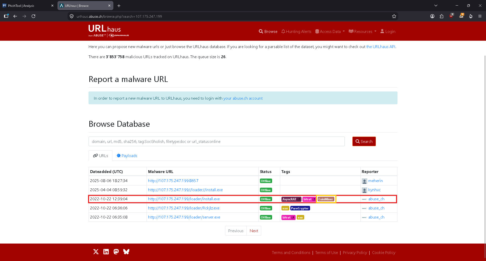
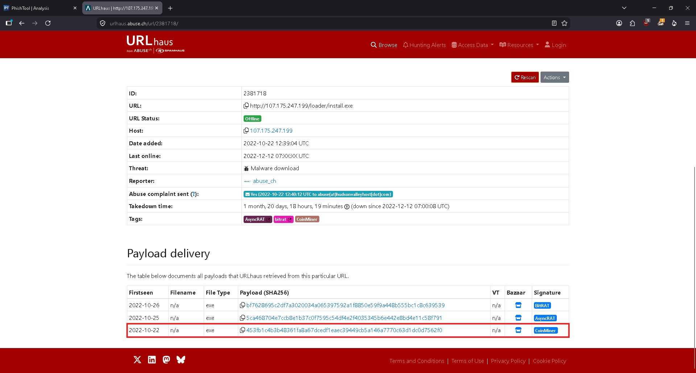

### 4.2 OSINT   WHOIS & Infrastructure Enrichment

Live lookups performed against the two malware-associated domains identified in dynamic analysis (§5.2):

| Domain | Finding |
|---|---|
| `gh9st[.]mywire[.]org` | `mywire.org` is the parent domain of **Dynu Systems' free dynamic DNS service** (registered to Dynu Systems Incorporated, creation date 2016-07-23). `gh9st` is a free customer-assigned subdomain, not independently registered infrastructure   consistent with commodity-RAT operators abusing free DDNS providers to obtain a resolvable hostname without domain-registration cost or the OSINT footprint a fresh registrar record would create. |
| `ripley[.]studio` | **No current public WHOIS record retrievable** as of this investigation (August 2026). Given the domain's malicious activity window on URLhaus dates to October 2022 (~4 years prior), this is consistent with the domain having expired and been released since the campaign concluded   a plausible explanation, not a confirmed one, since no historical WHOIS snapshot was available to verify original registration details. |

**Assessment:** The use of a free DDNS subdomain for `gh9st.mywire.org` is itself an actionable finding   it means static domain-registration-based reputation scoring (e.g., "newly registered domain" heuristics) would not have flagged this indicator, since the parent domain (`mywire.org`) is a decade-old legitimate service. Detection has to target the subdomain/behavior pattern rather than registration metadata for this class of infrastructure.

## 5. Malware Identification

### 5.1 CoinMiner Sample

- **SHA-256:** `453fb1c4b3b48361fa8a67dcedf1eaec39449cb5a146a7770c63d1dc0d7562f0`
- **VirusTotal Detection:** 55/70 vendors flag as malicious
- **Filename:** `install.exe`
- **Notable tags:** `peexe`, `direct-cpu-clock-access`, `shellcode`, `long-sleeps`, `detect-debug-environment`, `checks-network-adapters`, `spreader`
- **Contacted infrastructure:** `hxxp[://]ripley[.]studio/loader/uploads/[randomized-filename]`, `hxxp[://]107.175.247[.]199/loader/server.exe`

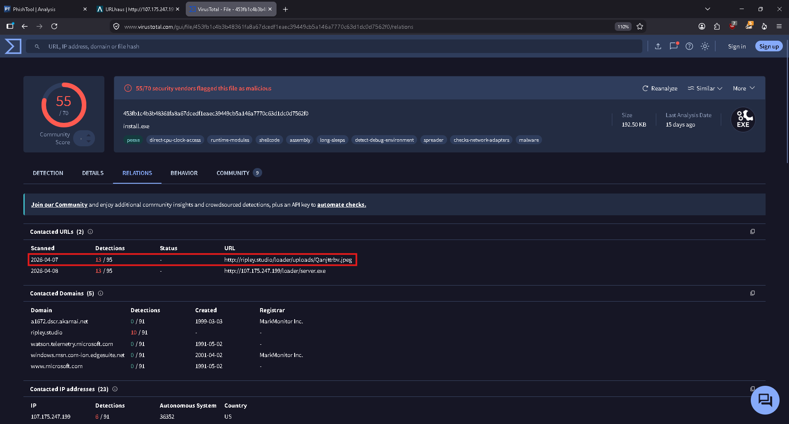

### 5.2 BitRAT Sample

- **SHA-256:** `bf7628695c2df7a3020034a065397592a1f8850e59f9a448b555bc1c8c639539`
- **MD5:** `86c57967785fe8dbcdf209fb564f9a85`
- **SHA-1:** `c388ca38a675e0709f3d62ae985d6b74f195123f`
- **MalwareBazaar Signature:** BitRAT (tags: `trojan`, `loader`)

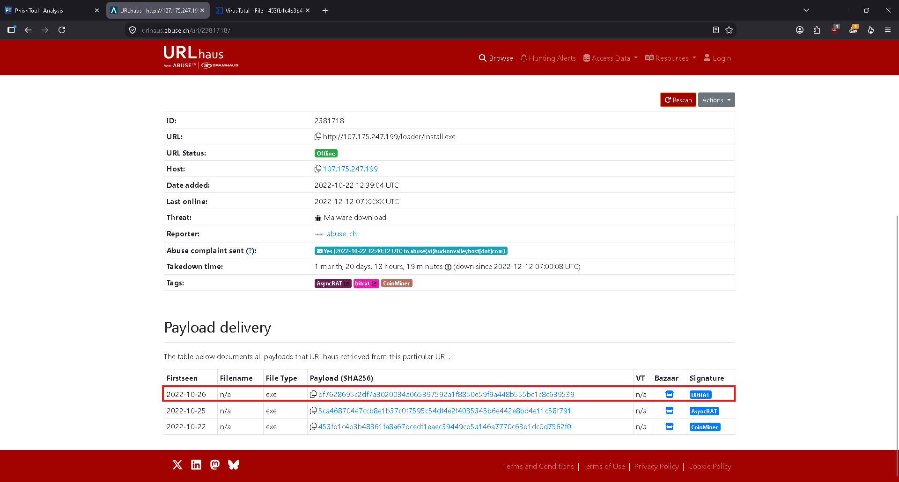
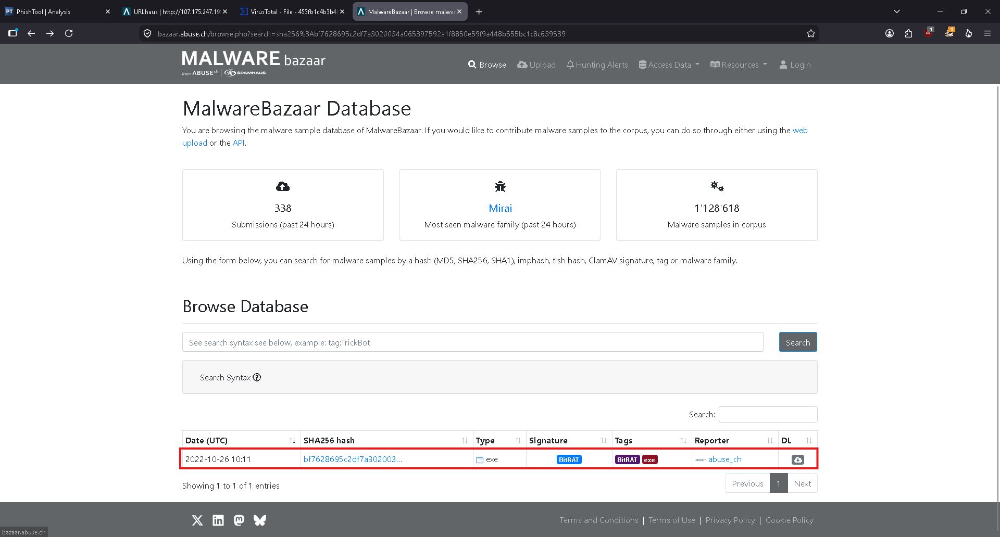
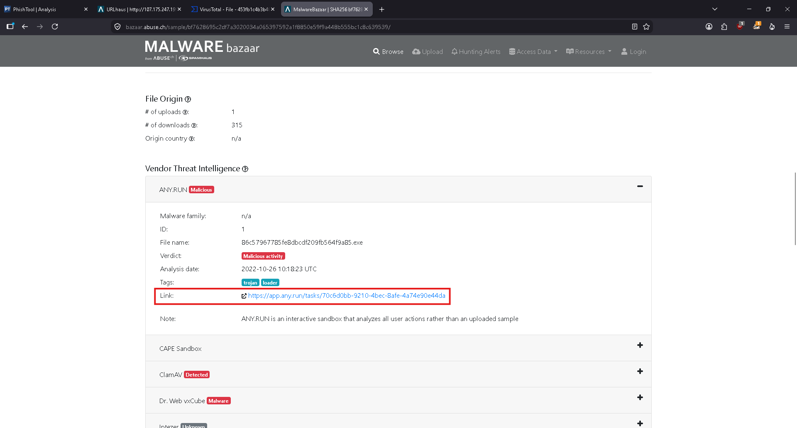

#### Dynamic Analysis (ANY.RUN   Threat Score 100/100, Malicious)

**Process chain:** `86c57967785fe8dbcdf209fb564f9a85.exe` → spawns `powershell.exe` (Base64-encoded command) → re-spawns itself → spawns a second `powershell.exe` → drops final payload.

**Persistence   Registry Autorun:**

| Field | Value |
|---|---|
| Operation | Write |
| Registry Key | `HKEY_CURRENT_USER\Software\Microsoft\Windows\CurrentVersion\Run` |
| Value Name | `Jzwvix` |
| Value Data | `C:\Users\admin\AppData\Roaming\Ozndzodb\Jzwvix.exe` |
| Type | `REG_SZ` |

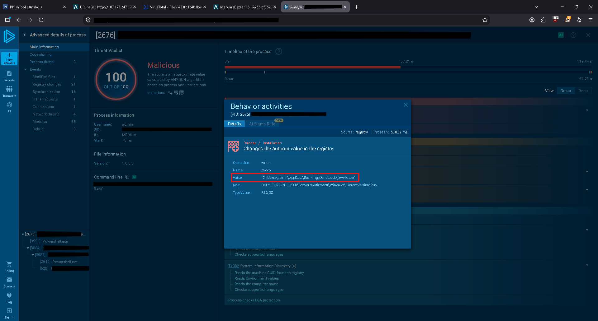
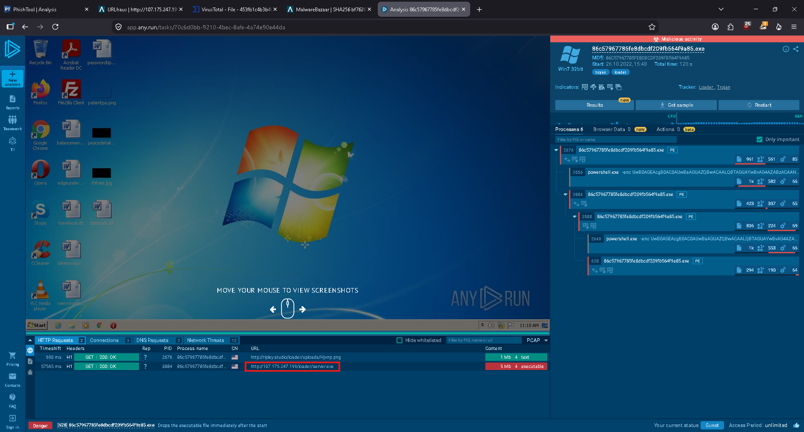
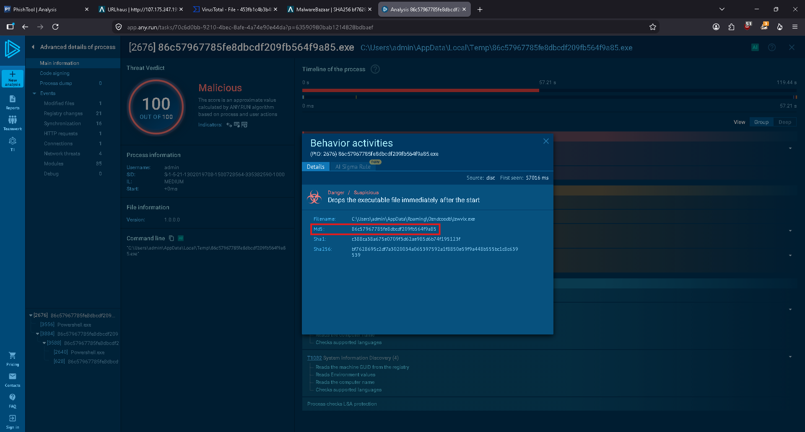

**Sandbox Evasion   Execution Delay:**

The encoded PowerShell command (`-enc UwB0AGEAcgBOAC0AUwBsAGUAZQBwACAALQBTAGUAYwBvAG4AZAB...`), decoded via CyberChef (`From Base64`), resolves to:

```
Start-Sleep -Seconds 50
```

This introduces a 50-second delay before further execution   a common technique to outlast automated sandbox timeout windows.

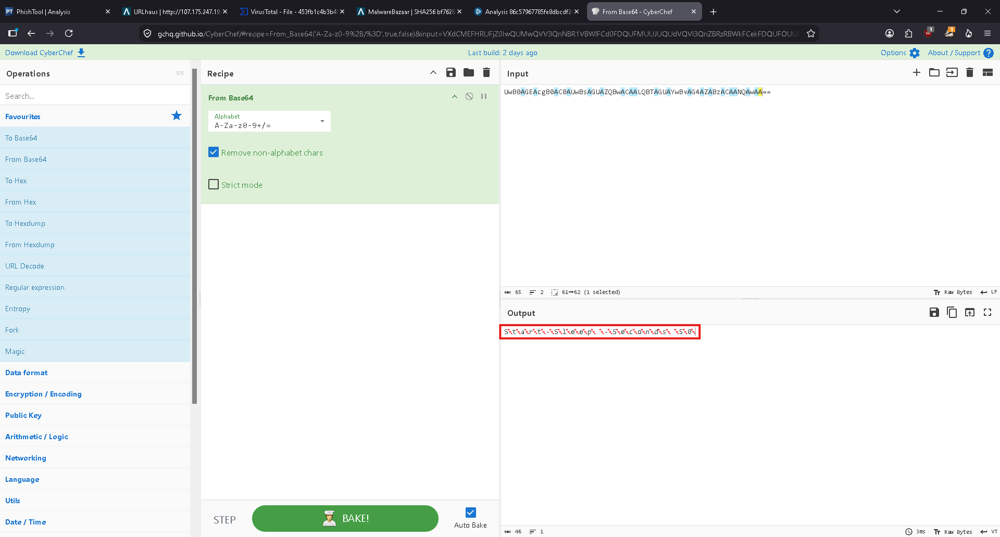

**Network   C2 and Staging:**

| Type | Domain/IP | Purpose |
|---|---|---|
| DNS | `ripley[.]studio` → `107.175.247[.]199` | Payload staging (secondary file retrieval) |
| DNS | `gh9st[.]mywire[.]org` → `162.191.38[.]27` | BitRAT C2 domain (dynamic DNS provider) |
| HTTP GET | `hxxp[://]107.175.247[.]199/loader/server.exe` | Secondary payload download |

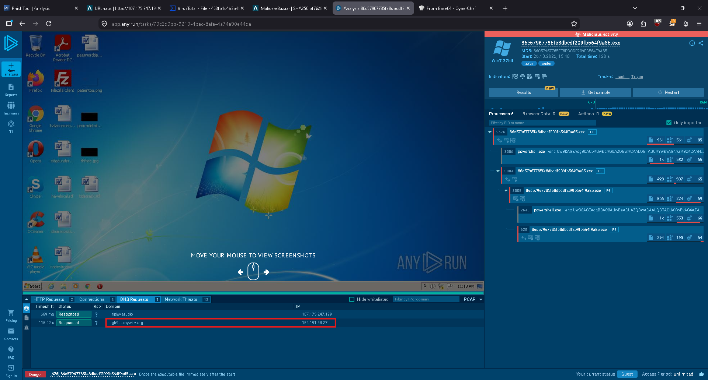

### 5.3 AsyncRAT Sample

- **SHA-256:** `5ca468704e7ccb8e1b37c0f7595c54df4e2f4035345b6e442e8bd4e11c58f791`
- **URLhaus Tags:** AsyncRAT, bitrat


#### Secondary Sandbox Validation (tria.ge)

Additional dropped binary observed: `C:\Users\Admin\AppData\Local\Temp\Yz1ZFNGk.exe`. Network capture confirms Telegram-based C2:

| Type | Indicator |
|---|---|
| DNS | `api.telegram[.]org` |
| GET (x4, repeated polling) | `hxxps[://]api.telegram[.]org/bot5610920260/AAHF8huJMzSwUso7E5WSzQW0Bzo4GdubP4k/getUpdates?offset=-5` |

**Assessment:** AsyncRAT is abusing the legitimate Telegram Bot API (`getUpdates` long-poll endpoint) as its C2 channel   a technique that blends with normal HTTPS traffic to legitimate infrastructure and evades naive domain-reputation blocking. **Telegram Bot ID: `bot5610920260`.**

An unrelated outbound request to `www.xenarmor[.]com` (license-check callback) was also observed in the same sandbox run; this appears to be noise from a bundled/unrelated component rather than part of the core malware chain and was not investigated further within this lab's scope.

**Scope note   PureCrypter:** The URLhaus table in §4.1 lists a third payload (`Rckjlz.exe`, tagged PureCrypter) served from the same host. It was not independently sandboxed or hash-analyzed in this investigation   the lab's available screenshots/tooling only covered the CoinMiner, BitRAT, and AsyncRAT samples. Flagged here explicitly as out-of-scope rather than silently omitted.

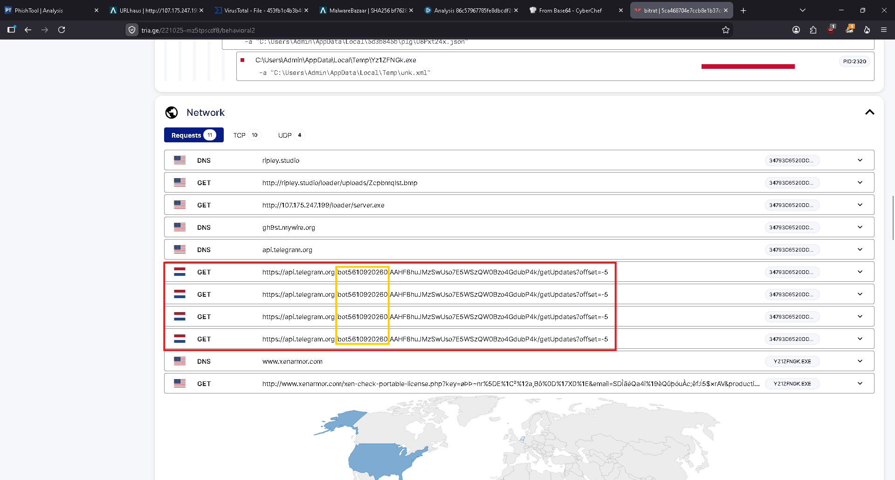

## 6. User Impact Assessment

No telemetry from the actual target mailbox or endpoint was available in this lab's scope (no EDR or mailbox logs provided), so impact below is assessed from sandbox payload behavior rather than confirmed device compromise:

- **If the link was clicked and the loader executed:** the BitRAT sample would establish registry-based persistence (`HKCU\...\Run\Jzwvix`), giving the actor a foothold surviving reboot, and would beacon to `gh9st.mywire[.]org` for C2 tasking   consistent with full remote-access-trojan capability (file access, keylogging, remote shell).
- **If the AsyncRAT variant was delivered instead:** C2 would be established over the Telegram Bot API, giving the actor a low-friction, hard-to-block channel for equivalent remote access.
- **Plausible worst-case exposure:** given the target is a faculty member at an educational institution, this includes credential theft (institutional email/LMS access), further lateral phishing to other faculty or students using the compromised identity, and cryptomining resource abuse on institutional hardware (CoinMiner payload).
- **Confirmed vs. assessed:** email delivery, sender spoofing, and the link-to-payload chain are confirmed via forensic evidence in this report. Whether the payload actually executed on the target's device is **not confirmed**   this section documents capability and exposure, not confirmed compromise.

## 7. MITRE ATT&CK Mapping

| Tactic | Technique | ID | Evidence |
|---|---|---|---|
| Initial Access | Phishing: Spearphishing Link | T1566.002 | Spoofed sender, embedded link to `hxxp[://]107.175.247[.]199/loader/install.exe` (§3, §4) |
| Execution | User Execution: Malicious Link | T1204.001 | Faculty target clicks embedded link to trigger download |
| Execution | Command and Scripting Interpreter: PowerShell | T1059.001 | Base64-encoded PowerShell invocation decoded to `Start-Sleep -Seconds 50` (§5.2) |
| Persistence | Boot or Logon Autostart Execution: Registry Run Keys | T1547.001 | `HKCU\...\CurrentVersion\Run\Jzwvix` → `Jzwvix.exe` (§5.2) |
| Defense Evasion | Virtualization/Sandbox Evasion: Time Based Evasion | T1497.003 | 50-second PowerShell sleep delay before payload execution (§5.2) |
| Command and Control | Web Service | T1102 | AsyncRAT C2 via legitimate `api.telegram.org` infrastructure (§5.3) |
| Command and Control | Application Layer Protocol: Web Protocols | T1071.001 | HTTPS `getUpdates` polling to Telegram Bot API (§5.3) |
| Impact | Resource Hijacking | T1496 | CoinMiner payload   cryptocurrency mining tags (`direct-cpu-clock-access`) on VirusTotal (§5.1) |

## 8. Draft Detection Logic (Learning Exercise)

As a practice exercise, three Sigma rules were drafted from behavior directly observed in this investigation (not generic templates)   an attempt to translate the sandbox findings above into detection logic. Rule source: [`Detections/`](./Detections/).

**Scope note:** these are first-draft rules written from lab evidence, not production-tested detections. Field names follow common Sysmon/proxy-log conventions but have not been validated against a specific SIEM schema, and no rule has been run through a Sigma converter or tested against real log data.

| Rule | File | Detects | ATT&CK |
|---|---|---|---|
| Suspicious Run Key Persistence from AppData Roaming | [`registry_autorun_appdata_roaming.yml`](./Detections/registry_autorun_appdata_roaming.yml) | HKCU Run key write pointing to an executable under `AppData\Roaming\<random>` | T1547.001 |
| Encoded PowerShell Command with Sandbox-Evasion Sleep | [`powershell_encoded_sleep_evasion.yml`](./Detections/powershell_encoded_sleep_evasion.yml) | `powershell.exe -enc` launched from a Temp/Roaming parent process | T1059.001, T1497.003 |
| Outbound HTTPS Request to Telegram Bot API getUpdates Endpoint | [`telegram_bot_api_c2_pattern.yml`](./Detections/telegram_bot_api_c2_pattern.yml) | Proxy/network logs showing `api.telegram.org/bot<id>/.../getUpdates` | T1102, T1071.001 |

Each rule documents its own false-positive conditions (e.g., legitimate software also installs to `AppData\Roaming`; legitimate internal Telegram bot integrations use the same endpoint pattern)   tune before production deployment rather than deploying as-is. Field names used (`TargetObject`, `c-uri`) follow Sysmon/generic-proxy conventions and have not been validated against a specific production SIEM schema.

## 9. IOC Summary

| Type | Indicator | Context |
|---|---|---|
| IP | `18.208.22[.]104` | Phishing email originating IP (SPF softfail) |
| IP | `107.175.247[.]199` | Malware distribution / loader host |
| IP | `162.191.38[.]27` | BitRAT C2 resolution |
| Domain | `ripley[.]studio` | Secondary payload staging (WHOIS: no current record   likely expired, §4.2) |
| Domain | `gh9st[.]mywire[.]org` | BitRAT C2 (Dynu free dynamic DNS subdomain, §4.2) |
| Domain | `api[.]telegram[.]org` | AsyncRAT C2 (Telegram Bot API) |
| URL | `hxxp[://]107.175.247[.]199/loader/install.exe` | Initial malware download |
| URL | `hxxp[://]107.175.247[.]199/loader/server.exe` | Secondary payload |
| SHA-256 | `453fb1c4b3b48361fa8a67dcedf1eaec39449cb5a146a7770c63d1dc0d7562f0` | CoinMiner |
| SHA-256 | `bf7628695c2df7a3020034a065397592a1f8850e59f9a448b555bc1c8c639539` | BitRAT |
| SHA-256 | `5ca468704e7ccb8e1b37c0f7595c54df4e2f4035345b6e442e8bd4e11c58f791` | AsyncRAT |
| Registry | `HKCU\Software\Microsoft\Windows\CurrentVersion\Run\Jzwvix` | BitRAT persistence |
| File Path | `C:\Users\admin\AppData\Roaming\Ozndzodb\Jzwvix.exe` | BitRAT dropped binary |
| Telegram Bot ID | `bot5610920260` | AsyncRAT C2 identifier |
| Email | `erikajohana.lopez[at]uptc[.]edu[.]co` | Spoofed sender/return-path |

## 10. Lessons Learned

1. **DMARC policy was not enforced at the mail gateway.** `uptc.edu.co` publishes `p=reject`, yet the message reached the inbox for analysis rather than being quarantined/rejected   indicating the receiving mail infrastructure (or this lab's simulated environment) was not honoring the sending domain's own policy.
2. **Shared malware infrastructure persisted for weeks and served multiple families before takedown.** The `/loader/` path at `107.175.247[.]199` served at least three analyzed payloads (CoinMiner, BitRAT, AsyncRAT) plus one unanalyzed (PureCrypter)   a single IOC block on this host earlier would have covered multiple malware families at once, showing high leverage in fast perimeter blocking of freshly-reported hosts.
3. **Legitimate service abuse defeated naive blocklisting.** Both C2 channels (Telegram Bot API, Dynu free DDNS) rode on infrastructure that is not inherently malicious. Static IP/domain blocklists age out and miss this pattern; the Sigma rules in §8 target behavior (bot-ID path structure, Roaming-folder autorun) specifically because of this.
4. **Sandbox-evasion via a 50-second sleep was trivial and effective against a naive analysis timeout.** ANY.RUN's continued monitoring past the delay is what surfaced the real behavior   reinforcing that dynamic analysis tooling needs sufficient observation windows, not just fast/cheap ones.

## 11. Recommendations

1. Block outbound traffic to `107.175.247[.]199`, `gh9st[.]mywire[.]org`, and `ripley[.]studio` at the perimeter/DNS layer.
2. Alert on registry writes to `HKCU\...\CurrentVersion\Run` originating from processes spawned out of `%AppData%\Roaming\`   a common autorun-persistence pattern.
3. Flag outbound HTTPS requests to `api.telegram.org` containing a `/bot<digits>/` path pattern as a C2-abuse indicator; this is increasingly common for commodity RATs.
4. Reinforce faculty phishing awareness: this lure relied on urgency (large invoice amount) and a spoofed known-contact identity   train staff to verify unexpected high-value "purchase confirmation" emails out-of-band before clicking any link.
5. Enforce/validate DMARC `p=reject` handling at the mail gateway   this message should have been quarantined given the domain's own policy.

## 12. Measurable Results

> Investigated a spear-phishing campaign targeting educational faculty via a spoofed $625,000 invoice lure; identified 15 IOCs across 3 malware families (CoinMiner, BitRAT, AsyncRAT); mapped TTPs to 8 MITRE ATT&CK techniques including T1566.002 (Spearphishing Link) and T1547.001 (Registry Run Key Persistence); authored 3 Sigma detection rules targeting the observed persistence and C2 patterns.
